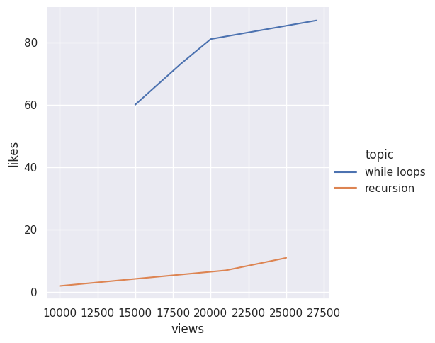
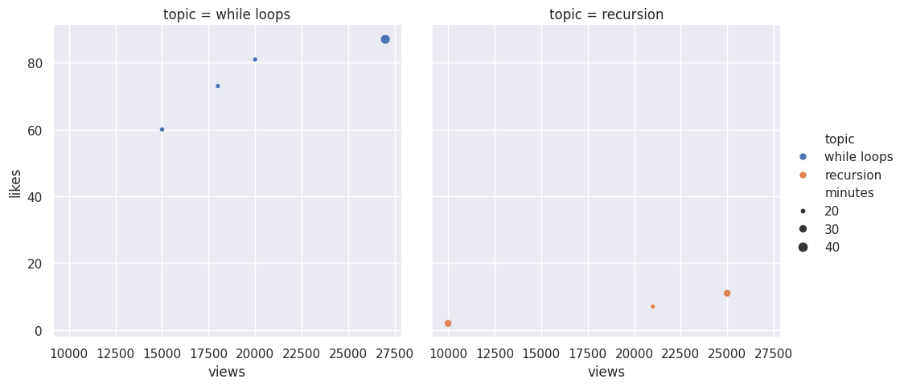

---
# Do not edit the text between these lines!
layout: default
---

# EX09: COMP110 Course Improvement Analysis

## Project Overview
This project analyzes student survey data from COMP110 to propose data-driven course improvements. I focused on student opinions regarding live-streaming in-person lectures.

## Key Idea
Live-streaming lectures creates value for students by increasing flexibility and accessibility, especially for those with scheduling conflicts or health needs.

## Data Visualizations
### Likes vs. Views by Topic (Line Chart)

### Likes vs. Views by Topic (Scatter Plot)

## Conclusion
The survey data strongly supports adding lecture live-streams. Over 70% of students rated the idea 5-7 (agree/strongly agree).
Potential trade-offs include technical setup work, but the benefits for student success outweigh the costs.
Future improvements could include adding recorded lecture archives alongside live streams.